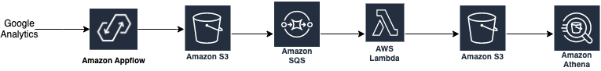

# Analyzing Google Analytics data with Amazon AppFlow, Amazon Athena, and AWS DataOps Development Kit

In this DDK example, you build a data pipeline that ingests Google Analytics data with Amazon AppFlow, processes it with an AWS Lambda function, before analyzing the results with Amazon Athena. It is inspired by this [blog post](https://aws.amazon.com/blogs/big-data/analyzing-google-analytics-data-with-amazon-appflow-and-amazon-athena/).



Note: It is assumed that a [OAuth connection](https://docs.aws.amazon.com/appflow/latest/userguide/google-analytics.html) between Amazon AppFlow and your Google resources was established.

## Walkthrough

To use the example, clone the repo:

```console
git clone https://github.com/aws-samples/aws-ddk-examples.git
```

Next, navigate into the example directory, and create a virtual environment:

```console
cd appflow_athena && python3 -m venv .venv
```

To activate the virtual environment, and install the dependencies, run:

```console
source .venv/bin/activate && pip install -r requirements.txt
```

If your AWS account hasn't been used to deploy DDK apps before, then you must bootstrap your environment first:

```console
ddk bootstrap
```

Open the `ddk_app/ddk_app_stack.py` file and update relevant values such as the Google Analytics object ID or the SQL query to use in Athena. Note that by default the pipeline is scheduled to ingest data every `1 hour`.

You can then deploy your DDK app:

```console
ddk deploy
```
