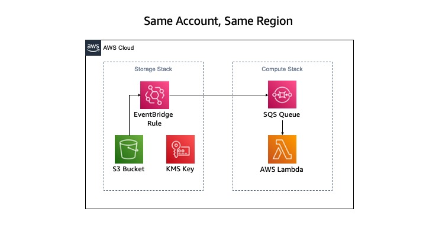
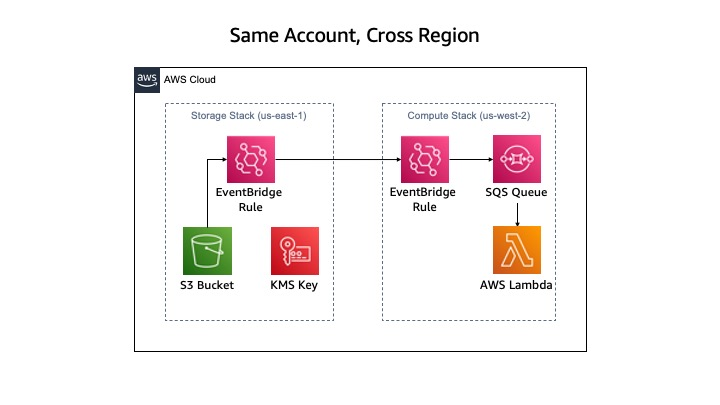
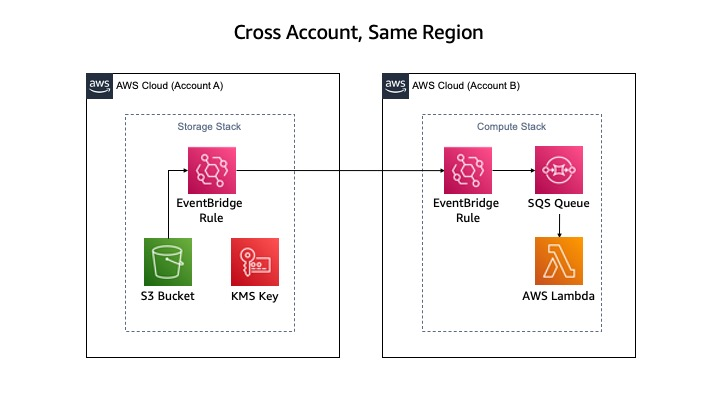
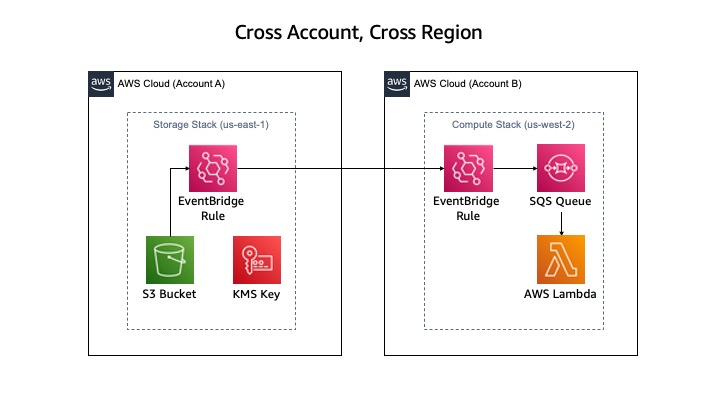

# Deployment Steps for Cross Account / Cross Region Data Pipelines

#

## Prerequisites for the Deployment

To complete this deployment, you'll need the following in your local environment:

- Programmatic access to an AWS Account

- Python (version 3.7 or above) and its package manager, pip (version 9.0.3 or above), are required

```
$ python --version
$ pip --version
```

- The AWS CLI installed and configured

```
$ aws --version
```

- The AWS CDK CLI (version 2.10 and above) installed, to upgrade use `npm install -g aws-cdk`

```
$ cdk --version
```

- The Git CLI (version 2.28 and above) installed and configured

```
$ git --version
```

If this is your first time using Git, set your git username and email by running:

```
$ git config --global user.name "YOUR NAME"
$ git config --global user.email "YOU@EMAIL.COM"
```

You can verify your git configuration with

```
$ git config --list
```

#

## Initial setup with the DDK CLI

At this time, the file in unzipped and you are in the directory. You will follow a set of commands depicted in the diagram below to configure and deploy the Cross Account / Cross Region Pipeline.

Continue to the steps below to set up the deployment:

Create and activate a virtualenv

```
$ python -m venv .venv && source .venv/bin/activate
```

Install the dependencies from requirements.txt
This is when the AWS DDK Core library is installed

```
$ pip install -r requirements.txt --no-cache-dir
```
# 

## Follow Instructions As Per Your Use Case

Based on your use case, refer to the following instructions to configure and deploy your data processing pipeline:

<center>

|          Use Case         |                   Link To Deploy Guide                  |
|:-------------------------:|:-------------------------------------------------------:|
|Same Account Same Region   | [Deployment Guide](#same-account-same-region-pipeline)  | 
|Same Account Cross Region  | [Deployment Guide](#same-account-cross-region-pipeline) |
|Cross Account Same Region  | [Deployment Guide](#cross-account-same-region-pipeline) |
|Cross Account Cross Region | [Deployment Guide](#cross-account-cross-region-pipeline)|

</center>

# 

## Same Account Same Region Pipeline



### CDK Bootstrapping

In order to deploy DDK apps, you need to bootstrap your environment with the correct environment name.

There are three environments to bootstrap for each of their respective regions and accounts (`cicd`, `stor`, `comp`). 


The `cicd` environemnt is where the source repository and CICD Pipeline will exist for your application. The `stor` environment is where the storage S3 Bucket and related resources (i.e. KMS Key, etc.). The `comp` environemnt is where the compute resources (i.e. SQS, Lambda, etc.) will exist for your application
<br />
```
$ cdk bootstrap aws://ACCOUNT-NUMBER-1/REGION-1 aws://ACCOUNT-NUMBER-2/REGION-2 aws://ACCOUNT-NUMBER-3/REGION-3
```
or 

```
$ cdk bootstrap --profile [CICD_PROFILE]
$ cdk bootstrap --profile [STOR_PROFILE]
$ cdk bootstrap --profile [COMP_PROFILE]
```

### Editing ddk.json 

Open the `ddk.json` file in the codebase and edit each of your `cicd`, `stor`, and `comp` environments with the correct `account` and `region`

Edit the `s3BucketName` in both the `stor` and `comp` environments for the name of the S3 Bucket to create

- The S3 Bucket Name should be the same for both `stor` and `comp` environments and MUST be globally unique to create a new S3 Bucket resource

### Performing Git Operations 
<br />

Initialise git for the repository

```
$ git init --initial-branch main
```

Execute the create repository command to create a new codecommit repository in the aws account

_NOTE: Make Sure the REPO_NAME matches the repository name value in the app.py file or vice versa before executing_

```
$ aws codecommit create-repository --repository-name REPO_NAME --profile [AWS_PROFILE] --region [AWS_REGION]
```

Add and push the initial commit to the repository

```
$ git add .
$ git commit -m "Configure DDK Data Pipeline"
$ git push --set-upstream origin main
```

### Deploying the Data Processing Pipeline

Verify the `ddk.json` is updated with your configuration and run the deploy command to deploy:

```
$ cdk deploy --profile [AWS_PROFILE]
```

#

## Same Account Cross Region Pipeline



### CDK Bootstrapping

In order to deploy DDK apps, you need to bootstrap your environment with the correct environment name.

There are three environments to bootstrap for each of their respective regions and accounts (`cicd`, `stor`, `comp`). 


The `cicd` environemnt is where the source repository and CICD Pipeline will exist for your application. The `stor` environment is where the storage S3 Bucket and related resources (i.e. KMS Key, etc.). The `comp` environemnt is where the compute resources (i.e. SQS, Lambda, etc.) will exist for your application
<br />
```
$ cdk bootstrap aws://ACCOUNT-NUMBER-1/REGION-1 aws://ACCOUNT-NUMBER-2/REGION-2 aws://ACCOUNT-NUMBER-3/REGION-3
```
or 

```
$ cdk bootstrap --profile [CICD_PROFILE]
$ cdk bootstrap --profile [STOR_PROFILE]
$ cdk bootstrap --profile [COMP_PROFILE]
```
### Editing ddk.json 

Open the `ddk.json` file in the codebase and edit each of your `cicd`, `stor`, and `comp` environments with the correct `account` and `region`

Edit the `s3BucketName` in both the `stor` and `comp` environments for the name of the S3 Bucket to create

- The S3 Bucket Name should be the same for both `stor` and `comp` environments and MUST be globally unique to create a new S3 Bucket resource

### Performing Git Operations 
<br />

Initialise git for the repository

```
$ git init --initial-branch main
```

Execute the create repository command to create a new codecommit repository in the aws account for the `cicd` environment

_NOTE: Make Sure the REPO_NAME matches the repository name value in the app.py file or vice versa before executing_

```
$ aws codecommit create-repository --repository-name REPO_NAME --profile [AWS_PROFILE] --region [AWS_REGION]
```

Add and push the initial commit to the repository

```
$ git remote add orign {URL}
$ git add .
$ git commit -m "Configure DDK Data Pipeline"
$ git push --set-upstream origin main
```

### Deploying the Data Processing Pipeline

Verify the `ddk.json` is updated with your configuration and run the deploy command to deploy:

```
$ cdk deploy --profile [AWS_PROFILE]
```

The AWS_PROFILE is the profile for the `cicd` environment to deploy in the same account and region as the source CodeCommit Repository


#

## Cross Account Same Region Pipeline



### CDK Bootstrapping

In order to deploy DDK apps, you need to bootstrap your environment with the correct environment name. Additionally, you will have to pass the other AWS Account IDs for the other environemnts to be trusted if you are deploying the pipeline following a cross account pattern.

There are three environments to bootstrap for each of their respective regions and accounts (`cicd`, `stor`, `comp`). 


The `cicd` environemnt is where the source repository and CICD Pipeline will exist for your application. The `stor` environment is where the storage S3 Bucket and related resources (i.e. KMS Key, etc.). The `comp` environemnt is where the compute resources (i.e. SQS, Lambda, etc.) will exist for your application
<br />
```
$ cdk bootstrap aws://ACCOUNT-NUMBER-1/REGION-1 aws://ACCOUNT-NUMBER-2/REGION-2 aws://ACCOUNT-NUMBER-3/REGION-3
```
or 

```
$ cdk bootstrap --profile [CICD_PROFILE]
$ cdk bootstrap --profile [STOR_PROFILE] --trust [CICD_ACCOUNT]
$ cdk bootstrap --profile [COMP_PROFILE] --trust [CICD_ACCOUNT]
``` 

_NOTE: The `--trust` parameters is only required for Cross Account patterns by passing multiple account IDs_

### Editing ddk.json 

Open the `ddk.json` file in the codebase and edit each of your `cicd`, `stor`, and `comp` environments with the correct `account` and `region`

- This Codebase supports ALL same account, cross account and cross region patterns for creating your data pipeline

Edit the `s3BucketName` in both the `stor` and `comp` environments for the name of the S3 Bucket to create

- The S3 Bucket Name should be the same for both `stor` and `comp` environments and MUST be globally unique to create a new S3 Bucket resource

### Performing Git Operations 
<br />

Initialise git for the repository

```
$ git init --initial-branch main
```

Execute the create repository command to create a new codecommit repository in the aws account for the `cicd` environment

_NOTE: Make Sure the REPO_NAME matches the repository name value in the app.py file or vice versa before executing_

```
$ aws codecommit create-repository --repository-name REPO_NAME --profile [AWS_PROFILE] --region [AWS_REGION]
```

Add and push the initial commit to the repository

```
$ git add .
$ git commit -m "Configure DDK Data Pipeline"
$ git push --set-upstream origin main
```

### Deploying the Data Processing Pipeline

Verify the `ddk.json` is updated with your configuration and run the deploy command to deploy:

```
$ cdk deploy --profile [AWS_PROFILE]
```

The AWS_PROFILE is the profile for the `cicd` environment to deploy in the same account and region as the source CodeCommit Repository

#

## Cross Account Cross Region Pipeline


### CDK Bootstrapping

In order to deploy DDK apps, you need to bootstrap your environment with the correct environment name. Additionally, you will have to pass the other AWS Account IDs for the other environemnts to be trusted if you are deploying the pipeline following a cross account pattern.

There are three environments to bootstrap for each of their respective regions and accounts (`cicd`, `stor`, `comp`). 


The `cicd` environemnt is where the source repository and CICD Pipeline will exist for your application. The `stor` environment is where the storage S3 Bucket and related resources (i.e. KMS Key, etc.). The `comp` environemnt is where the compute resources (i.e. SQS, Lambda, etc.) will exist for your application
<br />
```
$ cdk bootstrap aws://ACCOUNT-NUMBER-1/REGION-1 aws://ACCOUNT-NUMBER-2/REGION-2 aws://ACCOUNT-NUMBER-3/REGION-3
```
or 

```
$ cdk bootstrap --profile [CICD_PROFILE]
$ cdk bootstrap --profile [STOR_PROFILE] --trust [CICD_ACCOUNT]
$ cdk bootstrap --profile [COMP_PROFILE] --trust [CICD_ACCOUNT]
``` 

_NOTE: The `--trust` parameters is only required for Cross Account patterns by passing multiple account IDs_

### Editing ddk.json 

Open the `ddk.json` file in the codebase and edit each of your `cicd`, `stor`, and `comp` environments with the correct `account` and `region`

- This Codebase supports ALL same account, cross account and cross region patterns for creating your data pipeline

Edit the `s3BucketName` in both the `stor` and `comp` environments for the name of the S3 Bucket to create

- The S3 Bucket Name should be the same for both `stor` and `comp` environments and MUST be globally unique to create a new S3 Bucket resource

### Performing Git Operations 
<br />

Initialise git for the repository

```
$ git init --initial-branch main
```

Execute the create repository command to create a new codecommit repository in the aws account for the `cicd` environment

_NOTE: Make Sure the REPO_NAME matches the repository name value in the app.py file or vice versa before executing_

```
$ aws codecommit create-repository --repository-name REPO_NAME --profile [AWS_PROFILE] --region [AWS_REGION]
```

Add and push the initial commit to the repository

```
$ git add .
$ git commit -m "Configure DDK Data Pipeline"
$ git push --set-upstream origin main
```

### Deploying the Data Processing Pipeline

Verify the `ddk.json` is updated with your configuration and run the deploy command to deploy:

```
$ cdk deploy --profile [AWS_PROFILE]
```

The AWS_PROFILE is the profile for the `cicd` environment to deploy in the same account and region as the source CodeCommit Repository
