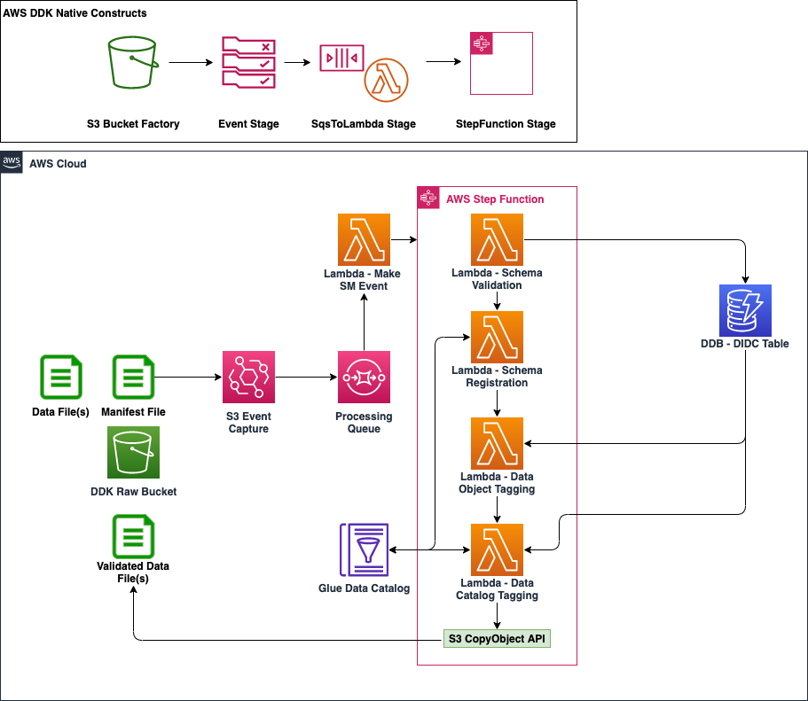

# Data-Validation-Cataloging-Pipeline Solution

This readme describes a data validation and cataloging pipeline solution which can be used in data lake usecase to validate/compare/catalog and tag incoming ingestion data based on various characteristics replicated from a business catalog. This solution based on data validation-cataloging patterns is generalized and can be reused by other data lake customers as well.

## Usecase
In Data Lake projects, there are various different phases ranging from ingestion, foundations and consumption. During the Ingestion phases, a lot of data is ingested to the data lake on S3 from various sources. Each source can have multiple datasets that will be ingested concurrently onto the platform. A lot of enterprise customer need to have to follow multiple steps of processing in order to maintain data privacy, compliance and intergrity making sure security of the platform is job zero. Enterprise customer also want to be agile in their move to the cloud and do not want to develop redundant solution. This solution demo showcases an example of parquet file being dropped in S3 bucket and triggering processing with a manifest file. This archicture helped the customer of reduce time to delivery and deploy multiple usecases to production. The use case assumes you have ingested data for various sources and already converted them to parquet in the expected s3 prefix path.

## Architecture

    
The foundational resources of the architecture include the S3 bucket, KMS keys, and SSM parameters. Also, a DIDC table is created in DynamoDB and populated with metadata on the datasets to be ingested and the schema of those datasets in order to handle schema validation checks and tagging of the data once validated.

The Architecture diagram consists of 3 stages:

1. S3 event stage: It creates an event through eventbridge that puts an incoming manifest file into an sqs queue based on s3 "manifest/" prefix path

2. SQS to Lambda Stage: This stage receives an event from the S3 event stage and triggers a lambda which reads the manifest file and creates a curated event for each dataset in the manifest file and triggers the step function for each dataset line item.

3. Custome State Machine stage: A series of steps each dataset goes through before it can be landed into a defined data lake, in our case "validated/" s3 prefix. The series of steps include schema validation, registering schema to a glue catalog, and tagging S3 objects data and the glue data catalog. The orchestration is handle through a step function using lambda for compute logic and to register the schema. The State Machine stage relies on the DIDC table in DynamoDB to perform schema validation checks and to tag the data with the necessary labels. The State Machine stage is triggered by a lambda with a curated event.

### Deploying And Running The Data Validation and Cataloging Pipeline pattern

## Prerequisites for the Deployment

To complete this deployment, you'll need the following in your local environment

Programmatic access to an AWS Account
Python (version 3.7 or above) and its package manager, pip (version 9.0.3 or above), are required

```
$ python --version
$ pip --version
```

The AWS CLI installed and configured

```
$ aws --version
```

The AWS CDK CLI (version 2.10 and above) installed, to upgrade use `npm install -g aws-cdk`

```
$ cdk --version
```

#

## Initial setup with the DDK CLI

Download this code base, unzip the file and change into this directory. Then follow a set of commands to set up DDK:

Create and activate a virtualenv

```
$ python -m venv .venv && source .venv/bin/activate
```

Install the dependencies from requirements.txt

```
$ pip install -r requirements.txt --no-cache-dir
```
#

### CDK Bootstrapping

In order to deploy DDK apps, you need to bootstrap your environment with the correct environment name.

Run the following command to bootstrap the environment for your respective AWS Account and Region:

```
$ cdk bootstrap --profile [AWS_PROFILE] or cdk bootstrap aws://ACCOUNT-NUMBER-1/REGION-1
```

### Editing ddk.json 

Open the `ddk.json` file in the codebase and edit the `account` and `region` parameters in the `dev` dictionary with the AWS Account ID and AWS Region to deploy the data validation and cataloging pipeline.

### Deploying the Data Processing Pipeline

Verify the `ddk.json` is updated with your configuration and run the deploy command to deploy:

```
$ cdk deploy --profile [AWS_PROFILE]
```

CloudFormation will begin to deploy a stack to create the resources required by the Data Ingestion Pipeline in your respective AWS Account and Region specified.

### Data Validation and Cataloging Sample Data

After deploying the infrastructure, in order to test the data validation and cataloging data pipeline you must first populate the DIDC table. The DIDC table is created in DynamoDB in order to store metadata on the datasets to be ingested and the schema of those datasets in order to handle schema validation checks and tagging of the data once validated. To populate the DIDC DynamoDB Table with some sample metadata, perform the following steps:

1. Ensure the python script located at `utils/didc/fill_didc.py` has the proper DIDC Table Name created in your AWS Account.

2. Run the following commands from your command line:

```
$ cd utils/didc
$ python3 fill_didc.py
```

Confirm that the DIDC DynamoDB Table now has been populated with these sample metadata records in the AWS Console. Next, to trigger the data validation and cataloging pipeline to start validating sample data, perform the following steps:

1. Ensure the shell script located at `utils/demo/deploy.sh` has the proper `RAW_BUCKET_NAME` for the S3 Bucket created in your AWS Account.

2. Run the following command from your command line (replacing the `AWS_PROFILE` with your AWS Profile Name).

```
$ cd utils/demo
$ sh deploy.sh AWS_PROFILE AWS_REGION
```

This shell script will first copy 4 sample parquet data files to the raw S3 Bucket under the `data/` prefix. Once data is in S3, a manifest file will be copied to the raw S3 Bucket under the `manifest/` prefix to trigger the data validation and cataloging state machine to invoke.

Validate that the state machine deployed has been invoked once for each file name that exists in the manifest file. 

_NOTE: There will be 1 of the 4 executions that will fail in the state machine. This is by design to show the usability of the data validation state machine to only allow proper data ingested to be validated and ingested into a data lake architecture. All of the successfully executions will ulitmately copy the data to the raw S3 Bucket under a new `validated/` prefix.


### Conclusion
The data validation and cataloging pipeline solution can be very helpful to validate/compare/catalog and tag incoming ingestion data based on various characteristics replicated from a business catalog. The solutions ensures each dataset goes through a series of steps before it lands into the data lake making sure that the data is validated, schema is registered, and data is tagged.