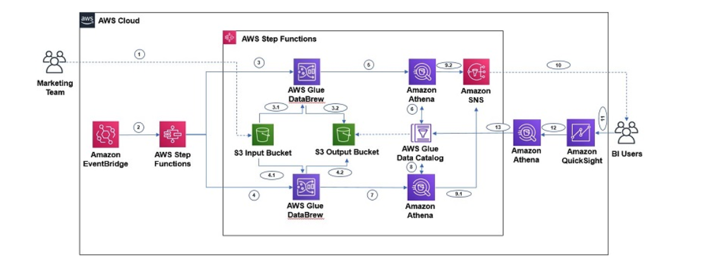

# Orchestrating an AWS Glue DataBrew job and Amazon Athena query with AWS Step Functions and AWS DataOps Development Kit

In this DDK example, you build a data pipeline which integrates a DataBrew job for data preparation, invoke a series of Athena queries for data refresh. It is inspired by this [blog post](https://aws.amazon.com/blogs/big-data/orchestrating-an-aws-glue-databrew-job-and-amazon-athena-query-with-aws-step-functions/).



The workflow includes the following steps:

* Step 1 – The Marketing team uploads the full CSV file to an S3 input bucket every month.
* Step 2 – An EventBridge rule, scheduled to run every month, triggers the Step Functions state machine.
* Steps 3 and 4 – Step Function triggers the DataBrew job, which create additional year, month, and day columns from the existing date field and uses those three columns for partitioning. The jobs write the final output to our S3 output bucket.
* Steps 5, 6, 7  – After the output data is written, we can create external table on top of it with Athena create table statements and then load partitions with MCSK REPAIR commands. After the AWS Glue Data Catalog table is created for marketing
* Steps 8, 9, 10 – After the marketing table data is refreshed, business users can use QuickSight for BI reporting, which fetches data through Athena. Data analysts can also use Athena to analyze the refreshed dataset.

# Walkthrough

Navigate into the example directory, and create a virtual environment:

```console
cd databrew-athena && python3 -m venv .venv
```

To activate the virtual environment, and install the dependencies, run:

```console
source .venv/bin/activate && pip install -r requirements.txt
```

If your AWS account hasn't been used to deploy DDK apps before, then you must bootstrap your environment first:

```console
cdk bootstrap --profile or cdk bootstrap aws://ACCOUNT-NUMBER-1/REGION-1
```

Open the `ddk_app/ddk_app_stack.py` file and update relevant values. Note that by default the pipeline is scheduled to ingest data every `1 hour`.

You can then deploy your DDK app:

```console
cdk deploy --profile [AWS_PROFILE]
```


