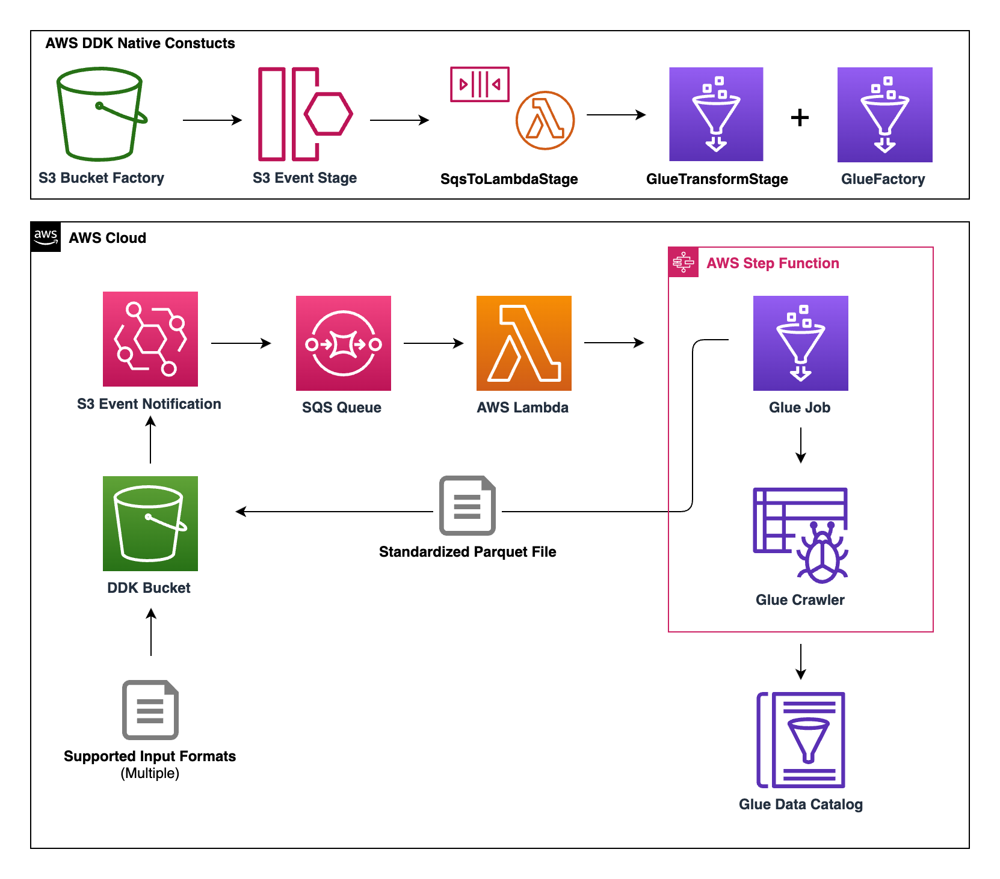
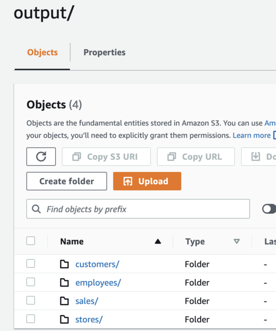
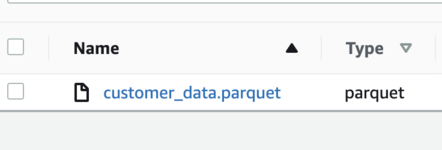
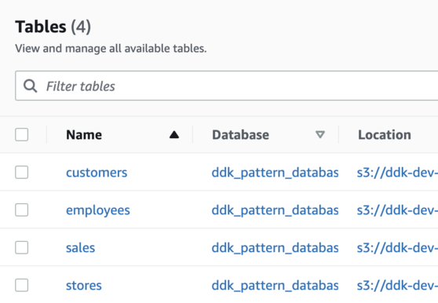

# File-Standardization-Pipeline Solution

## Overview
This pattern deploys an automated data pipeline that handles multiple different input file formats and creates a parquet version of the file, which is added to the Glue Catalog by a Glue Crawler. The code leverages the [AWS DataOps Development Kit (DDK)](https://awslabs.github.io/aws-ddk/) to deploy the infrastructure.


## Architecture
The instructions in this readme will help you deploy the following AWS architecture:

>


Here is a high-level overview of each service's role:

- S3 &rarr; Holds both the input and output data files (under separate S3 paths)

- EventBridge &rarr; Triggers data pipeline when a file is uploaded to input S3 path

- SQS &rarr; Queues the EventBridge events for the Lambda function

- Lambda &rarr; Consumes SQS messages and triggers the StepFunction

- StepFunction &rarr; Facilitates the Glue Job and the Glue Crawler execution

- Glue Job &rarr; Loads input data and outputs the data to output S3 path in parquet format, using [AWS SDK for Pandas](https://aws-sdk-pandas.readthedocs.io/en/stable/)

- Glue Crawler &rarr; Crawls the output S3 path and adds each dataset as a table to a Glue Database for future analytics

<br />

Feel free to dive into the DDK file, Glue Script, and Lambda code if you want to learn more about the implementation details.

## Prerequisites for the Deployment

To complete this deployment, you'll need the following in your local environment:

Programmatic access to an AWS Account
Node and its package manager, npm are required

```shell
node -v
npm -v
```

The AWS CLI installed and configured

```shell
aws --version
```

The AWS CDK CLI (version 2.10 and above) installed, to upgrade use `npm install -g aws-cdk`

```shell
cdk --version
```

## Initial setup with the DDK CLI

At this time, you should have downloaded the code for this pattern and should be in the top-level directory of this pattern.

Install the dependencies from `package.json`
This is when the AWS DDK Core library is installed

```shell
npm install
```

## CDK Bootstrapping

In order to deploy DDK apps, you need to bootstrap your environment with the correct environment name.

Run the following command to bootstrap the environment for your respective AWS Account and Region:

```shell
cdk bootstrap --profile [AWS_PROFILE] or cdk bootstrap aws://ACCOUNT-NUMBER-1/REGION-1
```

## Deploy the Data Pipeline

To deploy the pipeline, run the following command:

```shell
$ cdk deploy --profile [AWS_PROFILE]
```

This command should launch a CloudFormation template in the AWS account and should take a few minutes to create.

Once the CloudFormation stack has been successfully created, your AWS account now has the data pipeline outlined in the architecture section of this readme! 

## Testing the Data Pipeline

To test the data pipeline, you will upload multiple files with different file formats and different data to S3 using a shell command included in this repo. Within the "input_files" prefix, the script will upload each dataset to a top-level prefix to identify the dataset.

For example, the script will upload "sales.json" to "s3://DDK_BUCKET_NAME/input_files/sales/sales_data.json"

If the data pipeline is successful, all of the datasets will be added to the "output" prefix of the same S3 bucket in parquet format and the Glue Crawler should add each unique dataset as a table in the Glue Catalog.

For example, the "sales.json" dataset should end up in "s3://DDK_BUCKET_NAME/output/sales/sale_data.parquet". Also, the dataset  should be added to the Glue Catalog under the "ddk_pattern_database" Glue Database in a table named "sales".

In the command below replace **S3_BUCKET_NAME** with the the name of the S3 bucket created by DDK. (Hint: Your **S3_BUCKET_NAME** should be `ddk-filestandardization-bucket-YourAwsAccountNumber`)

Also, replace **AWS_PROFILE** with your profile name you have configured for your AWS CLI.

```shell
$ sh utils/upload_files.sh S3_BUCKET_NAME AWS_PROFILE
```

The above command will place four files into S3, and should trigger 4 separate, concurrent runs of the data pipeline. The pipeline should take a few minutes to complete, you can use StepFunctions to monitor completion of the Glue tasks.

If all four StepFunctions ran successfully, you should see something similar to the below in your S3 and Glue console...

**S3 "output" Prefix:**
>
---
**S3 "output/customer" Prefix:**
>
---
**Tables within "ddk_pattern_database" in the Glue Console:**
>


<br />
These Glue tables can be used for a variety of analytical purposes, including queries in Athena or visualization in QuickSight.

<br />

*Congrats: You now have tested an operational, file standardization data pipeline built by DDK!*

## Conclusion

This pattern used the DDK to deploy an automated data pipeline that receives input data in various file formats, creates a parquet version of the file, and adds the parquet file to a Glue database for future analytics.

The code in this pattern is very generic, and can be extended to include any custom transformations/ data processing that you may need. 

In general, this pattern provides the framework for more complex use-cases, while still providing easy-to-use infrastructure by using the DDK!

## Optional: Clean Up 

Enter the S3 bucket name created by this pattern and your AWS CLI profile name, then run the command below to empty the S3 bucket and delete all AWS resources created in this pattern.

```
sh utils/cleanup_script.sh S3_BUCKET_NAME AWS_PROFILE
```
