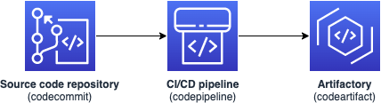

# Creating a private code artifactory with AWS CodeArtifact, and the AWS DataOps Development Kit

## Overview

This example details how to use the DDK to provision a private code artifactory. You create your own Python library called `ddk_lib`, and then make it available for others in the code artifactory.
A significant benefit of this approach is that once the library is hosted in the private artifactory, authenticated users can install it and reuse it in their own applications.
This strategy encourages collaboration and the sharing of best practice patterns within your organization.

Infrastructure deployed by this app includes a private CodeArtifact domain/repository hosting your Python library, and a continuous integration and deployment pipeline that builds, packages, and pushes the artifacts into the artifactory. 
You are now fully equipped to distribute and reuse your Python code across your organization!



## Walkthrough

Navigate into the example directory, and create a virtual environment:

```console
cd private-artifactory && python3 -m venv .venv
```

To activate the virtual environment, and install the dependencies, run:

```console
source .venv/bin/activate && pip install -r requirements.txt
```

If your AWS account hasn't been used to deploy DDK apps before, then you must bootstrap your environment first:

```console
cdk bootstrap
```

You can then deploy your DDK app:

```console
cdk deploy
```

Once the app is provisioned, the CI/CD pipeline builds and packages the artifact.

## Using the library

Now that the library is available in the private AWS CodeArtifact domain, authenticated users can leverage it in their own apps:

To authenticate to the domain, use:
```console
aws codeartifact login --tool twine --domain ddk-lib-domain --domain-owner <account-id> --repository ddk-lib-repository
```

You can then install the library using PIP and use it as you would use any other Python library:

```console
pip install ddk_lib
```
