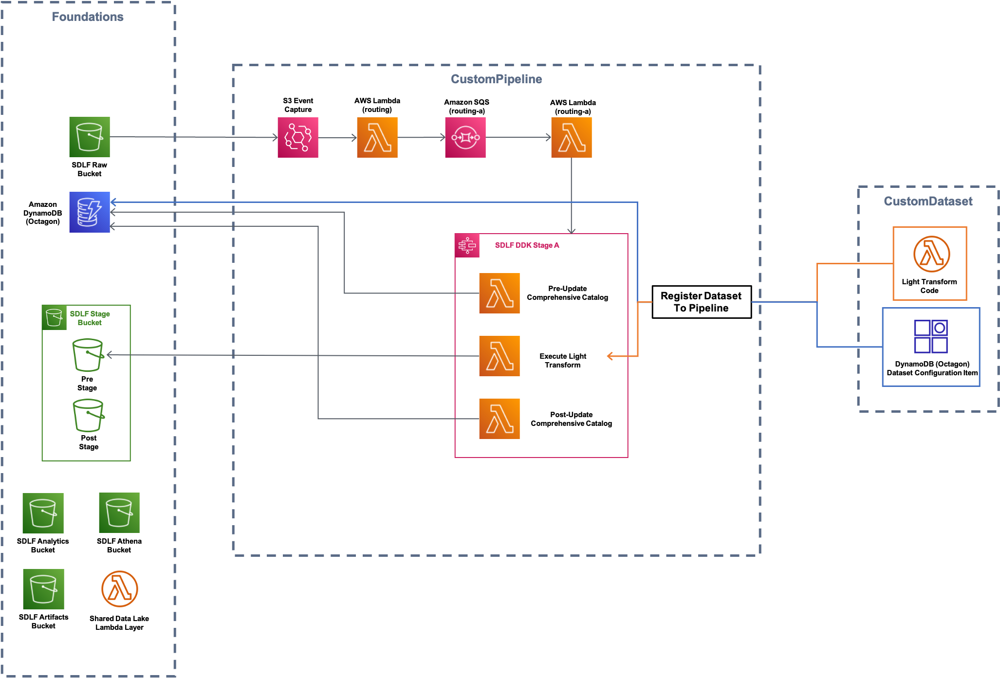
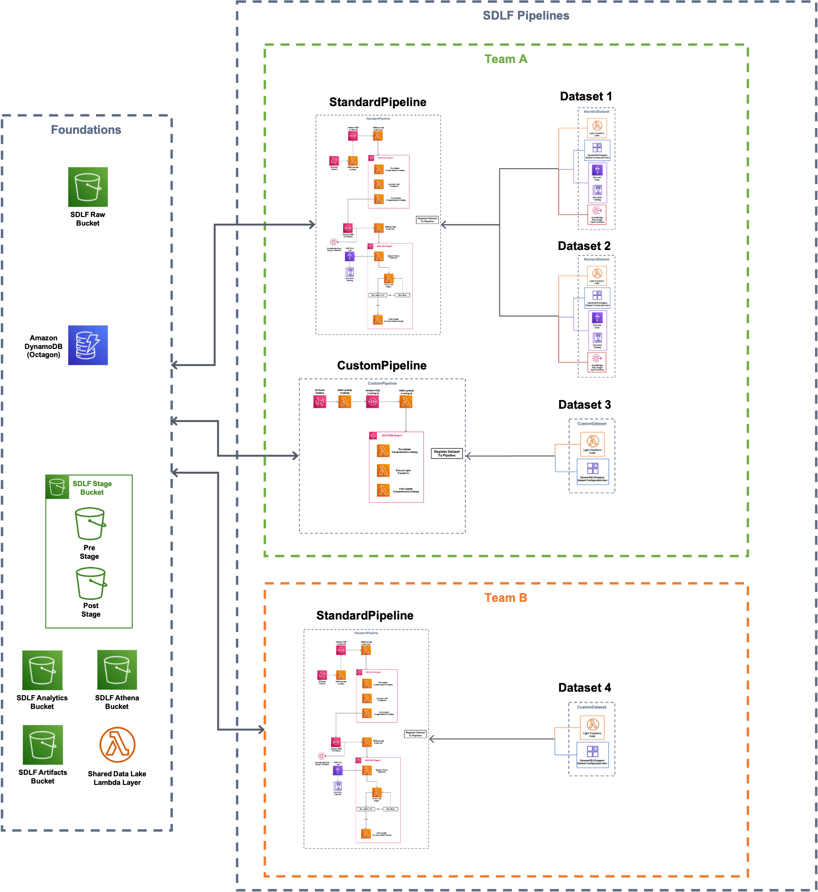

# DDK Serverless Data Lake Framework

This code base is a platform that leverages the [Serverless Data Lake Framework](https://github.com/awslabs/aws-serverless-data-lake-framework/) (SDLF) and [AWS DataOps Development Kit](https://awslabs.github.io/aws-ddk/) (DDK) to accelerate the delivery of enterprise data lakes on AWS.

<br />

**Purpose**

The Purpose of the DDK Serverless Data Lake Framework is to shorten the deployment time to production from several months to a few weeks. Refactoring SDLF on top of the AWS DDK framework allows for more flexible use cases, further customization, and higher level abstraction to reduce the learning curve and make data lakes easier to deploy.

<br />

**Contents:**

- [Reference Architecture](#reference-architecture)
- [Prerequisites for the Deployment](#prequisites-for-the-deployment)
- [AWS Service Requirements](#aws-service-requirements)
- [Deployment](#deployment)
- [Parameters](#parameters)
- [Resources Deployed](#resources-deployed)

<br />
<br />

## Reference Architecture

The reference code in this code base provides two pipelines to illustrate how teams can author and use new pipelines. The first pipeline is the `StandardPipeline` whose architecture can be seen below. The default values in `parameters.json` deploys a single instance of this pipeline with one team (`"demoteam"`) and one dataset (`"legislators"`).


In addition, we define a `CustomPipeline` which is just the stage A of the `StandardPipeline`. This pipeline serves to demonstrate how teams can author custom pipelines an include them in the framework. See the [Adding New Pipelines](#adding-new-pipelines) section below for more details.



Finally, by adding additional records to the `parameters.json` file you can deploy multiple datasets for multiple teams with multiple pipelines. An example of what this architecture might look like is shown below.



<br />
<br />

## Prerequisites for the Deployment

<br />

To complete this deployment, you'll need the following in your local environment

Programmatic access to an AWS Account
Python (version 3.9 or above) and its package manager, pip (version 9.0.3 or above), are required

```
$ python --version
$ pip --version
```

The AWS CLI installed and configured

```
$ aws --version
```

The AWS CDK CLI (version 2.10 and above) installed, to upgrade use `npm install -g aws-cdk`

```
$ cdk --version
```

The Git CLI (version 2.28 and above) installed and configured

```
$ git --version
```

If this is your first time using Git, set your git username and email by running:

```
$ git config --global user.name "YOUR NAME"
$ git config --global user.email "YOU@EMAIL.COM"
```

You can verify your git configuration with

```
$ git config --list
```
<br />
<br />

## AWS Service Requirements

<br />

The following AWS services are required for this utility:

1. [AWS Lambda](https://aws.amazon.com/lambda/)
2. [Amazon S3](https://aws.amazon.com/s3/)
3. [AWS Glue](https://aws.amazon.com/glue/)
4. [Amazon DynamoDB](https://aws.amazon.com/dynamodb/)
5. [AWS Identity and Access Management (IAM)](https://aws.amazon.com/iam/)
6. [Amazon Simple Queue Service](https://aws.amazon.com/sqs/)
7. [AWS Key Management Service (KMS)](https://aws.amazon.com/kms/)
8. [AWS Lake Formation](https://aws.amazon.com/lake-formation/)
9. [AWS EventBridge](https://aws.amazon.com/eventbridge/)

## Deployment

<br />

### Initial setup with the DDK CLI

<br />

At this time, the file is unzipped and you are in the directory. You will follow a set of commands depicted in the diagram below to configure and deploy SDLF using DDK.

Continue to the steps below to set up DDK:

Install AWS DDK CLI, a command line interface to manage your DDK apps

```
$ pip install aws-ddk
```

To verify the installation, run:

```
$ ddk --help
```

Create and activate a virtualenv

```
$ python -m venv .venv && source .venv/bin/activate
```

Install the dependencies from requirements.txt
This is when the AWS DDK Core library is installed

```
$ pip install -r requirements.txt --no-cache-dir
```
<br />
<br />

### Bootstrapping with Default Admin Policy

<br />

If your AWS account hasn't been used to deploy DDK apps before, then you need to bootstrap your environment for both the `cicd` and the `dev` environments:

```
$ ddk bootstrap --help
$ ddk bootstrap --profile [AWS_PROFILE] -e cicd
```

```
$ ddk bootstrap --help
$ ddk bootstrap --profile [AWS_PROFILE] -e dev -a [CICD_ACCOUNT]
```

<br />
<br />

### Adding LakeFormation Data Lake Settings

<br />

In the AWS Console, navigate to AWS Lake Formation. Click on Settings on the left-hand side menu and make sure both boxes are unchecked:

- `Use only IAM access control for new databases`
- `Use only IAM access control for new tables in new databases`

Click the `Save` button on the bottom right-hand side of the page when done.

Next, click on `Administrative roles and tasks` on the left-hand side menu and click on `Choose Administrators`. Add both:

- Your current IAM role as a Data Lake administrator
- The `CloudFormationExecutionRole` IAM role name returned by the DDK Bootstrap Stack for the environment you are deploying to (e.g. `ddk-ENV-hnb659fds-cfn-exec-ACCOUNTID-REGION`)

<br />
<br />

### Configure ddk.json 

<br />

You might recognize a number of files typically found in a CDK Python application (e.g. app.py, cdk.json...). In addition, a file named `ddk.json` holding configuration about DDK specific constructs is present.

Before deploying the pipeline, edit the `ddk.json` file for the environment you are deploying to with:

1. The correct AWS Account ID in `account` field
2. The region to deploy the DDK SDLF Example in the `region` field


The `ddk.json` is the same level as `app.py`. 

Additionally, edit the `parameters.json` file under the path `data_lake/pipelines/parameters.json` with the correct:

1. `team` — The name of the team which owns the pipeline.
2. `pipeline` — Name to give the pipeline being deployed.
3. `dataset` - Name of the dataset being deployed.
4. `stage_a_transform` - Name of the python file containing light transform code.
5. `stage_b_transform` - Name of the python file containing heavy transform code.

If the parameters are not filled, default values for team, pipeline, dataset, stage_a_transform, and stage_b_transform will be used (see Reference Architecture section above).

<br />
<br />

### Performing Git Operations 
<br />

Initialise git for the repository

```
$ git init --initial-branch main
```

Execute the create repository command to create a new codecommit repository in the aws account

_NOTE: Make Sure the REPO_NAME matches the repository name value in the `cicd` environment of the `ddk.json` file or vice versa before executing_

```
$ ddk create-repository REPO_NAME --profile [AWS_PROFILE] --region [AWS_REGION]
```

Add and push the initial commit to the repository

```
$ git add .
$ git commit -m "Configure SDLF DDK"
$ git push --set-upstream origin main
```
<br />
<br />

### Deploying SDLF 

<br />

Once the above steps are performed, verify the below and run the deploy command to deploy SDLF

1.  `ddk.json` file is updated with required configuration
2.  `parameters.json` file is updated if required

```
$ ddk deploy --profile [AWS_PROFILE]
```

The deploy all step deploys an AWS CICD CodePipeline along with its respective AWS CloudFormation Stacks. The last stage of each pipeline delivers the SDLF Data Lake infrastructure respectively in the child (default dev) environment through CDK/CloudFormation.

_Note: when you do the initial deployment in a brand new account, you may encounter some transient errors in CodePipeline or CodeBuild as it may take some time (typically a couple of hours) for AWS to provision your capacity in those services. If this happens you can wait some time and click the Retry button on CodePipeline to retry a failed stage._

<br />
<br />

### Datasets

<br />

A dataset is a logical construct referring to a grouping of data. It can be anything from a single table to an entire database with multiple tables, for example. However, an overall good practice is to limit the infrastructure deployed to the minimum to avoid unnecessary overhead and cost. It means that in general, the more data is grouped together the better. Abstraction at the transformation code level can then help make distinctions within a given dataset.

Examples of datasets are:

- A relational database with multiple tables (E.g. Sales DB with orders and customers tables)
- A group of files from a data source (E.g. XML files from a Telemetry system)
- A streaming data source (E.g. Kinesis data stream batching files and dumping them into S3)

For this QuickStart, a Glue database alongside Lake Formation permissions are created for each dataset. However, this will depend on the use case with the requirements for unstructured data or for a streaming data source likely to be different. The structure of the dataset, and what infrastructure is deployed with it, depend on the pipeline it belongs to.

<br />
<br />

### Pipelines

<br />

A data pipeline can be thought of as a logical construct representing an ETL process that moves and transforms data from one area of the lake to another. The pipelines directory is where the blueprints for the data pipelines, their stages, and their datasets are defined by data engineers. In addition, generic stages to be used across multiple pipelines can be defined in the pipelines/common_stages directory. For instance, the definition for a step function stage orchestrating a Glue job and updating metadata is abstracted in the `sdlf_heavy_transform.py` file within the common_stages directory. This definition is not specific to a particular job or crawler, instead the Glue job name is passed as an input to the stage. Such a configuration promotes the reusability of stages across multiple data pipelines.

In the pipelines directory, these stage blueprints are instantiated and wired together to create a data pipeline. Borrowing an analogy from object-oriented programming, blueprints defined in the stages directory are “classes”, while in the pipelines directory these become “object instances” of the class.

<br />
<br />

### Data Lake Processing sample data

<br />

- If you are using this in a burner account or for demos, you can use the demo data and default `data_lake_parameters` in `ddk.json` to test the data lake functionality.

- Before you execute the below command, make sure to go into copy.sh and provide the necessary details for the variables such as `BUCKET_NAME`, `PROFILE` and `REGION`. Once executed it will put the data in respective s3 bucket and start data lake processing. You can update the file to also copy other sample data, or change the `DATASET` and `TEAM` parameters to test multiple pipelines.

```
$ sh ./examples/copy.sh
```

<br />
<br />


## Adding New Datasets with Custom Transformations in the Same Pipeline

<br />

1. For the `parameters.json` file located at the path `data_lake/pipelines/`, specify a new dictionary for the creation of a new dataset, for example:

```
{
    "dev": [
        {
            "team": "demoteam",
            "pipeline": "standard",
            "dataset": "legislators",
            "stage_a_transform": "sdlf_light_transform",
            "stage_b_transform": "sdlf_heavy_transform"
        },
        {
            "team": "demoteam",
            "pipeline": "standard",
            "dataset": "newdata",
            "stage_a_transform": "sdlf_light_transform_new",
            "stage_b_transform": "sdlf_heavy_transform_new"
        }
    ]
}
```

2. Create new transformation code for the new dataset for both the Stage A and Stage B step functions to use to process your data being ingested (the defaults one created are `sdlf_light_transform.py` and `sdlf_heavy_transform.py`). Add the transformation code to the following paths for light and heavy transforms respectively:

```
data_lake/src/layers/data_lake_library/python/datalake_library/transforms/stage_a_transforms/sdlf_light_transform.py

data_lake/src/layers/data_lake_library/python/datalake_library/transforms/stage_b_transforms/sdlf_heavy_transform.py
```

NOTE: Use the `sdlf_light_transform.py` and `sdlf_heavy_transform.py` as reference for how to structure the file. The names of the files should match the names of the `stage_a_transform` and `stage_b_transform` specified in the `parameters.json` above.

3. Add a new python script for a Glue Job specific to this dataset under the path:

```
data_lake/src/glue/pyshell_scripts/sdlf_heavy_transform/<TEAM_NAME>/<DATASET_NAME>/main.py
```

NOTE: The `TEAM_NAME` and `DATASET_NAME` as part of the file path should match the dataset specified in the `parameters.json` above.

4. Push your code to the remote CodeCommit repository and the DDK SDLF Data Lake will automatically create new resources for your additional dataset.

<br />
<br />


## Adding New Pipelines

<br />

If you want to provide different step machines that what is provided out of the box for DDK SDLF, follow the steps below:

1. In the `data_lake/pipelines/parameters.json` file, specify a new dictionary for the creation of a new pipeline, for example:

```
{
    "dev": [
        {
            "team": "demoteam",
            "pipeline": "standard",
            "dataset": "legislators",
            "stage_a_transform": "sdlf_light_transform",
            "stage_b_transform": "sdlf_heavy_transform"
        },
        {
            "team": "demoteam",
            "pipeline": "main",
            "dataset": "newdata",
            "stage_a_transform": "main_light_transform",
            "stage_b_transform": "main_heavy_transform"
        }
    ]
} 
```

2. Follow the steps for adding a **Adding New Datasets with Custom Transformations in the Same Pipeline** above for the new dataset specified in the `parameters.json` (Ensure that the `dataset` name does NOT exist in other pipelines for the same team).

3. Adding new Custom Stage to a Pipeline

- Determine what the new pipeline must look like and if you can re-use existing stages or require new custom stages.

- Add a folder to the pipelines directory for your custom pipeline, e.g. "pipelines/main_pipeline/".

- If required to have custom stages, create new files in the folder for your pipeline with the custom stages you wish to have for your data processing pipeline by using the default `data_lake/pipelines/common_stages/sdlf_light_transform.py` and `data_lake/pipelines/common_stages/sdlf_heavy_transform.py` files as reference.

    - The default stages `sdlf_light_transform.py` and `sdlf_heavy_transform.py` include lambdas, queues and step function definitions for your pipeline written as CDK and DDK Constructs

    -  Ensure the custom stages have the following function (`def get_target()` is the first resource triggered in the stage):
    
    ```
    def get_targets(self) -> Optional[List[IRuleTarget]]:
        return [LambdaFunction(self._lambda)]
    ```

- Add the stages in the `__init__.py` file of your custom pipeline directory.

4. Creating a new Custom Pipeline

- Add Python files to define both your pipeline and it's associated dataset to your custom pipeline directory. You can use the `pipelines/standard_pipeline/standard_pipeline.py` and `pipelines/standard_pipeline/standard_dataset.py` as examples.

    - You should define the base, shared (across datasets) infrastructure of the pipeline in it's `__init__(...)` method.
    
    - Each pipeline must implement the `SDLFPipeline` protocol defined in `pipelines/sdlf_base_stack.py`. Specifically, it must provide a `register_dataset(self, dataset: str, config: dict[str, Any])` function which creates any infrastructure specific to each dataset and registers the dataset to the pipeline (such as creating EventBridge rules for new data arriving in S3 for that dataset). It must also include a `PIPELINE_TYPE` class variable that defines the value used in `parameters.json` to register a dataset to that pipeline.

    - As seen in `standard_pipeline.py` link the custom stages in your Data Pipeline using the DDK `DataPipeline` class as shown below:

```py
self._data_lake_pipeline: DataPipeline = (
    DataPipeline(
        self,
        id=self._pipeline_id,
        name=f"{self._resource_prefix}-DataPipeline-{self._team}-{self.PIPELINE_TYPE}-{self._environment_id}",
        description=f"{self._resource_prefix} data lake pipeline",
    )
    .add_stage(self._s3_event_capture_stage)  # type: ignore
    .add_stage(self._data_lake_light_transform, skip_rule=True)  # configure rule on register_dataset() call
    .add_stage(data_lake_heavy_transform, skip_rule=True)
)
```

_NOTE: You can leverage AWS DDK’s built-in S3 Event Stage to set up event-driven architectures and trigger your data processing pipelines_

- Once you have defined your pipeline and stages, allow teams to use the pipeline by updating the `data_lake/pipelines/sdlf_base_stack.py` similar to the following:

    - Change the code block in the `sdlf_base_stack.py` file to check the `customer_config` for your custom `pipeline_type` and create the pipeline as seen below:

```py
for customer_config in customer_configs:
    ...
        if pipeline_type == StandardPipeline.PIPELINE_TYPE:
            pipeline = StandardPipeline(
                self,
                construct_id=f"{team}-{pipeline_type}",
                environment_id=self._environment_id,
                resource_prefix=self._resource_prefix,
                team=team,
                foundations_stage=self._foundations_stage,
                wrangler_layer=self._wrangler_layer,
                app=self._app,
                org=self._org,
                runtime=lmbda.Runtime.PYTHON_3_9
            )
        elif pipeline_type == YourCustomPipeline.PIPELINE_TYPE:
            pipeline = YourCustomPipeline(...)  # Create Pipeline
    ...
```

5. Push your code to the remote CodeCommit repository and the DDK SDLF Data Lake will automatically create new resources for your additional pipeline.

<br />
<br />

## Cleaning Up SDLF Infrastructure

<br />

Once the solution has been deployed and tested, use the following command to clean up the resources

```
$ make delete_all
```

_NOTE:_ Before running this command, look into the `Makefile` and ensure that:

1.  The `delete_repositories` function is passing the correct `-d REPO_NAME` (default: `sdlf-ddk-example`)

2.  The `delete_bootstrap` function is passing the correct `--stack-name BOOTSTRAP_STACK_NAME` (default: `DdkDevBootstrap`)

3.  For Single account deployment, make sure you change the `CICD`, `CHILD` variables to your same respective aws profile name. Also update the `ENV` matching `ddk.json`

This command will use a series of CLI commands and python scripts in order to clean up your AWS account environment.

